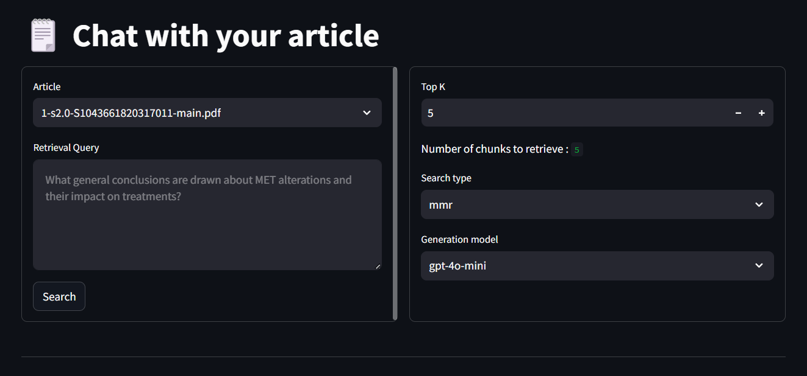
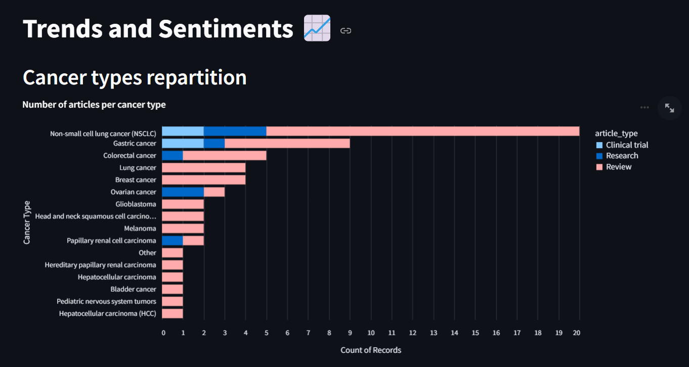
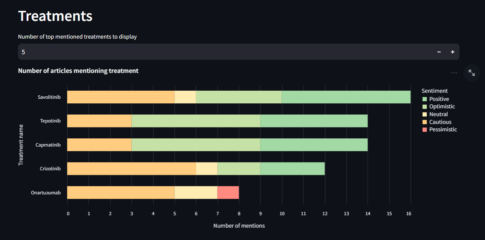

# Your Biomedical Knowledge Assistant 🧬📚

InsightMed is a powerful, AI-driven tool designed to simplify and accelerate the exploration of scientific articles in the biomedical domain. Whether you're navigating complex literature on topics like MET (Mesenchymal-Epithelial Transition) or analyzing treatment trends, this solution provides a streamlined interface to interact with, summarize, and visualize insights from scientific research.

## Features 🚀

1. Chat with Your Article 🗨️

    Engage in a conversation with individual research articles. Simply upload a PDF, ask questions, and receive contextually accurate answers based on the content of the article.

    - Configure options such as the number of chunks to retrieve, the search method, and the generation model.
    - Designed to save hours of manual reading and comprehension.

    

2. Summarize Your Article ✍️

    Get concise, structured summaries of any uploaded article.

    - Upload the PDF and let the tool extract key insights and generate a summary.
    - Perfect for quickly understanding research without reading every detail.

3. Treatment Visualization Dashboard 📊

    Gain a broader perspective by visualizing data extracted from multiple articles.

    - View trends and features such as treatment mentions, types of cancers addressed, article classifications (e.g., research vs. clinical review), and publication dates.
    - Perform sentiment analysis to identify the most promising treatments based on authors' tones.
    - Color-coded and interactive graphs highlight key insights.

    
    

## Getting Started 💻

### Prerequisites

- Python 3.10+

### Installation

1. Clone this repository:

    ```bash
    git clone https://github.com/your-repo/biomedical-knowledge-assistant.git
    cd biomedical-knowledge-assistant
    ```

2. Install dependencies:

    ```bash
    pip install -r requirements.txt
    ```
3. Add your OpenAI API key to the `.env` file:

    ```bash
    touch .env
    echo "OPENAI_API_KEY=your-api-key" > .env
    ```

### Running the Application

1. Start the FastAPI backend:

    ```bash
    fastapi run src/main_fastapi.py
    ```

2. Start the Streamlit front-end:

    ```bash
    streamlit run front/Welcome.py
    ```

3. Access the application:

    - API: http://localhost:8000/docs
    - Web App: http://localhost:8501

## Technologies Used 🛠️
- FastAPI: Backend API framework for efficient deployment.
- Streamlit: Front-end interface for user interaction.
- LangChain: Framework for handling document retrieval and LLM-based generation.
- OpenAI GPT: Language model for summarization, Q&A, and sentiment analysis.
- Pandas & Matplotlib: Data extraction and visualization.

## Contributing 🤝
We welcome contributions to improve this project! Feel free to:
- Submit issues or feature requests.
- Fork the repo and create pull requests.

## Acknowledgments 💡
Thank you for using the Biomedical Knowledge Assistant!
If you have any ideas or feedback, don't hesitate to share them. Together, we can make scientific knowledge more accessible to everyone.

---

*Developed with ❤️ for advancing biomedical research understanding*